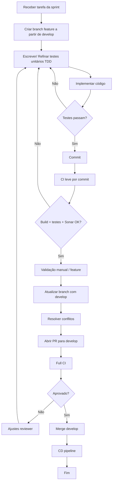
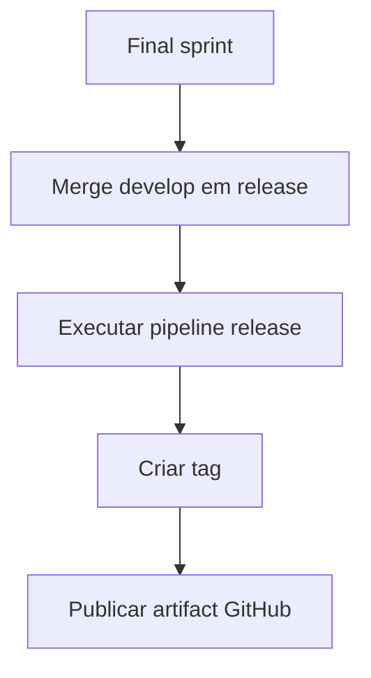

# Fluxo Oficial de Desenvolvimento — Projeto EnerSight

## Contexto
Projeto **EnerSight** da **CoderHood**: plataforma web para ingestão, tratamento e análise geoespacial de dados públicos da ANEEL, com backend em Spring Boot, ingestor em Python 3.12 e PostgreSQL.

---

## Ciclo de Sprint

- **Duração:** 4 semanas
- **Semana 1:** Review + Retrospective + Planning
- **Semanas 2–4:** Desenvolvimento
- **Encerramento:** merge `develop` → `release`, tag semântica e publicação de release artifact no GitHub

---

## Convenções

### Gitflow
- Branches principais:
  - `develop`
  - `release`

### Branch de tarefa
`<task-id>/<task-title-summary>`

### Commit
`<task-id>: <type-of-change>(<scope-of-change>) <commit-summary>`

Exemplo:
`ES-104: feat(ingestion) adiciona parser de arquivos GDB`

---

## Fluxo Operacional

---

## Pipeline

### CI leve (commit/push)
- Compilação
- Unit tests
- Lint
- SonarQube
- Build artefato temporário

### Full CI (PR)
- Unit tests
- Integration tests
- Testes API
- Build Docker
- Sonar gate
- Coverage
- Security scan

### CD (merge ``release``)
- Deploy ambiente prod
- Smoke test
- Release notes

---

## Release

---

## Resumo

1. TDD obrigatório;
2. CI em todo commit;
3. Full CI apenas em PR;
4. Sonar como gate;
5. Merge bloqueado sem aprovação;
6. ``develop`` sempre atualizada antes do PR;
7. ``release`` atualizada apenas no fechamento da sprint.
